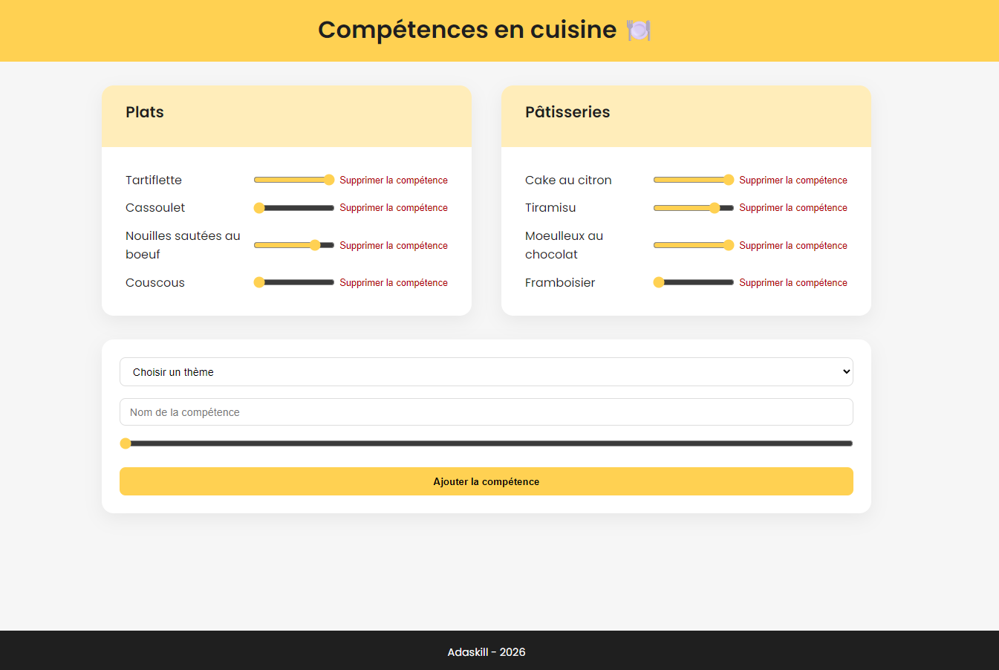

# adaskill

# 🍽️ Adaskill - Gestionnaire de Compétences



## 🎯 Aperçu

Adaskill est une application de gestion de compétences (skills) permettant de :

- Organiser vos compétences par thèmes
- Évaluer votre niveau sur une échelle de 0 à 5
- Ajouter, modifier et supprimer des compétences
- Visualiser vos compétences de manière claire et interactive

## ✨ Fonctionnalités

- ✅ **Affichage des compétences** organisées par thèmes
- ✅ **Ajout de nouvelles compétences** via un formulaire
- ✅ **Modification du niveau** en temps réel avec un slider
- ✅ **Suppression de compétences**
- ✅ **Interface responsive** (mobile, tablette, desktop)
- ✅ **Design moderne** avec effets hover et transitions fluides

## 🛠️ Technologies utilisées

### Backend

- **Node.js** - Environnement d'exécution JavaScript
- **Express.js** - Framework web minimaliste
- **Neon Database** - Base de données PostgreSQL serverless
- **dotenv** - Gestion des variables d'environnement
- **CORS** - Gestion des requêtes cross-origin

### Frontend

- **HTML5** - Structure de la page
- **CSS3** - Styles et responsive design
- **Vanilla JavaScript** - Logique applicative (Fetch API, DOM manipulation)

### Base de données

- **PostgreSQL** (via Neon) avec deux tables :
  - `themes` : stockage des thématiques
  - `skills` : stockage des compétences liées aux thèmes

## 📁 Structure du projet

```
adaskill/
│
├── back/
│   ├── index.js          # Serveur Express + routes API
│   ├── package.json
│   └── .env              # Variables d'environnement (non versionné)
│
├── front/
│   ├── index.html        # Structure HTML
│   ├── style.css         # Styles CSS + responsive
│   └── script.js         # Logique JavaScript
│
└── README.md
```

📄 Licence

Ce projet est libre de droits pour un usage éducatif.

👨‍💻 Auteur

Océane Thauvin
